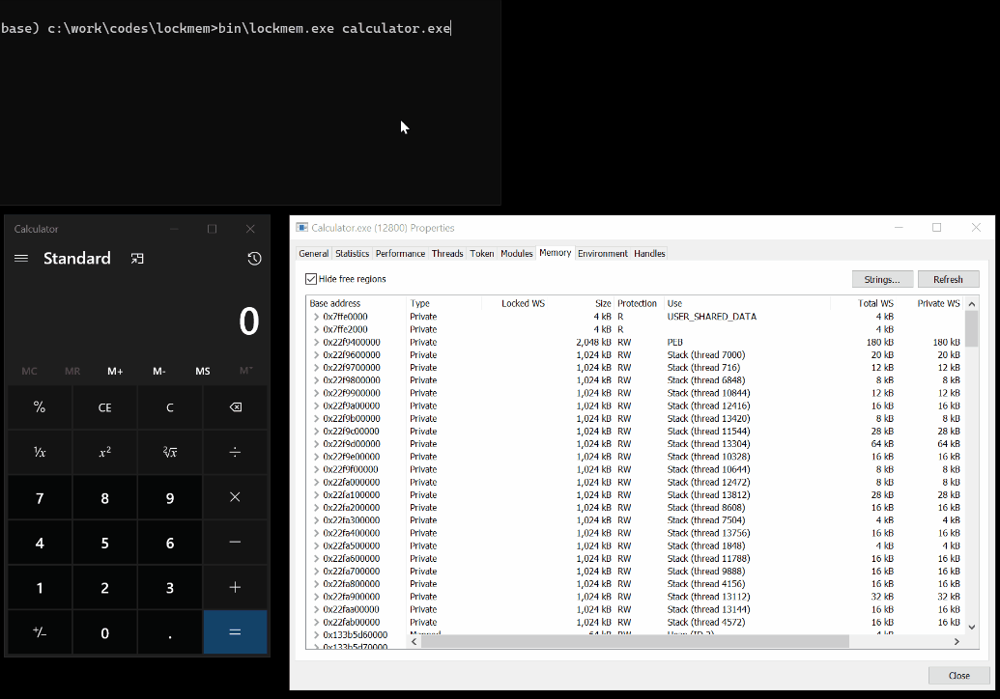

# lockmem


This utility allows you to lock every available memory regions of an arbitrary process into its working set.
It uses `ntdll!NtLockVirtualMemory` (syscall used internally by [VirtualLock](https://docs.microsoft.com/en-us/windows/win32/api/memoryapi/nf-memoryapi-virtuallock)) to lock memory ranges as well as [GetProcessWorkingSetSizeEx](https://docs.microsoft.com/en-us/windows/win32/api/memoryapi/nf-memoryapi-getprocessworkingsetsizeex) and [SetProcessWorkingSetSizeEx](https://docs.microsoft.com/en-us/windows/win32/api/memoryapi/nf-memoryapi-setprocessworkingsetsizeex) to increase the size of the process' working set.

The Windows kernel guarantees that those pages will stay resident in memory, not written to the [pagefile](https://docs.microsoft.com/en-us/windows/client-management/introduction-page-file) and not incur a page fault on access.



## Build

```text
(base) c:\lockmem\src>nmake

Microsoft (R) Program Maintenance Utility Version 14.26.28806.0
Copyright (C) Microsoft Corporation.  All rights reserved.

        if not exist ..\bin mkdir ..\bin
        cl /O1 /nologo /ZI /W3 /D_AMD64_ /DWIN_X64 /sdl /Fe..\bin\lockmem.exe lockmem.cc /link /nologo /debug:full ntdll.lib
lockmem.cc
        del *.obj *.pdb *.idb
        if exist .\bin del bin\*.exp bin\*.ilk bin\*.lib

(base) c:\lockmem\src>..\bin\lockmem.exe
./lockme <process name | pid>
```